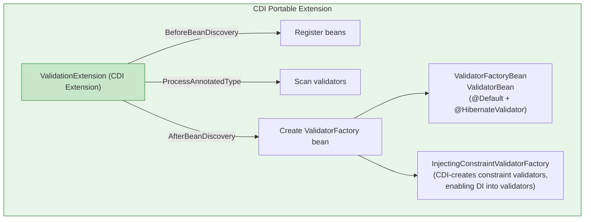
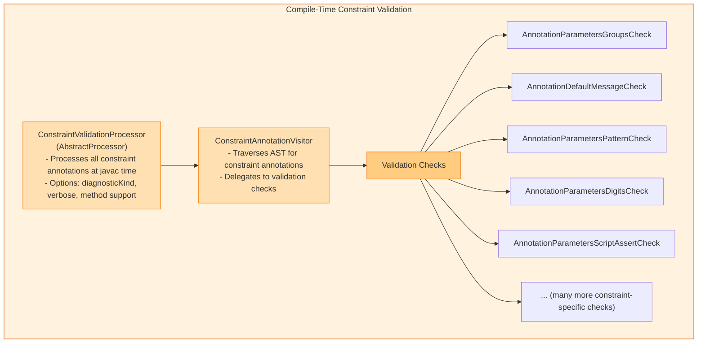
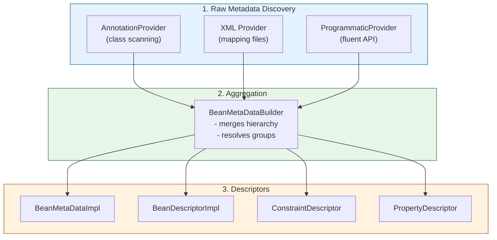
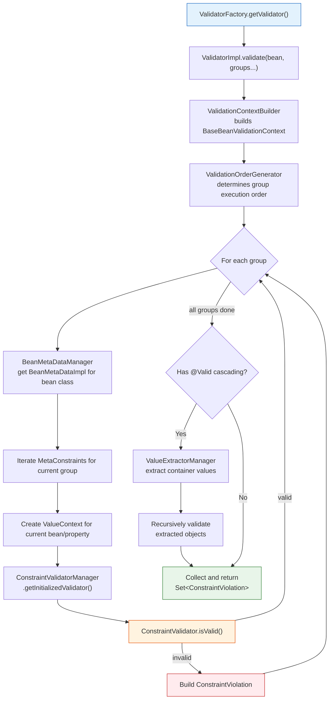

# Hibernate Validator - Architecture

## Overview

Hibernate Validator is the reference implementation of the Jakarta Bean Validation specification (currently targeting 3.1). It is a mature, full-featured validation framework with extensive support for custom constraints, CDI integration, XML configuration, and compile-time annotation processing.

**Version:** 9.2.0-SNAPSHOT
**Total Java files:** ~1,092 (engine: 798, annotation-processor: 167, cdi: 65, test-utils: 11, integration tests: 51)

---

## Module Structure

```
hibernate-validator/
├── engine/                    # Core validation engine (798 files)
├── cdi/                       # CDI portable extension (65 files)
├── annotation-processor/      # Compile-time constraint checker (167 files)
├── tck-runner/                # Jakarta BV TCK compliance runner
├── test-utils/                # Shared test utilities (11 files)
├── integrationtest/           # WildFly + Java modules integration tests
│   ├── wildfly/               # WildFly server tests (51 files)
│   └── java/modules/          # Java module system tests
├── performance/               # JMH benchmarks
├── documentation/             # Generated docs
├── build/                     # Build infrastructure
├── parents/                   # Parent POMs (internal/public)
├── bom/                       # Bill of Materials
└── distribution/              # Distribution packaging
```

---

## Engine Architecture Diagram

```mermaid
graph TB
    subgraph API["PUBLIC API"]
        VF["ValidatorFactory<br/>(Jakarta BV API)"]
        V["Validator<br/>(Jakarta BV API)"]
        VFI["ValidatorFactoryImpl<br/>- config container<br/>- thread-safe cache<br/>- creates validators"]
        VI["ValidatorImpl<br/>- validate()<br/>- validateProperty()<br/>- validateValue()"]
        VF --> VFI
        V --> VI
        VFI --> VI
    end

    subgraph META["METADATA LAYER"]
        subgraph BMM["BeanMetaDataManager"]
            BMD["BeanMetaDataImpl<br/>- class constraints<br/>- property constraints<br/>- executable constraints<br/>- group sequences"]
            MC["MetaConstraint&lt;A&gt;<br/>- constraint location<br/>- constraint descriptor<br/>- extraction path<br/>- links to ConstraintTree"]
        end
        subgraph PROVIDERS["Metadata Providers (pluggable)"]
            AP["Annotation<br/>Provider"]
            XP["XML<br/>Provider"]
            PP["Programmatic<br/>Provider"]
        end
        CL["Constraint Location Hierarchy:<br/>Bean | Field | Getter | Parameter | ReturnValue | TypeArgument"]
    end

    subgraph ENGINE["VALIDATION ENGINE"]
        VCB["ValidationContext<br/>Builder"] --> BBVC["BaseBeanValidation<br/>Context<br/>- metadata refs<br/>- validator manager<br/>- message interpolator<br/>- traversable resolver<br/>- value extractor mgr"]
        CVM["ConstraintValidatorManager<br/>- caches initialized validators<br/>- CacheKey: annotation+type+ctx"]
        CT["ConstraintTree<br/>- hierarchical constraint model<br/>- composition rules<br/>- matched validators per type"]
        VOG["ValidationOrderGenerator<br/>- resolves group execution order<br/>- expands group inheritance<br/>- handles @GroupSequence"]
        VC["ValueContext<br/>- current object<br/>- current property<br/>- cascading info"]
    end

    subgraph VALIDATORS["CONSTRAINT VALIDATORS"]
        subgraph BV["Jakarta BV Standard (@bv)"]
            BV1["@NotNull, @NotEmpty, @NotBlank<br/>@Size, @Min, @Max, @Pattern<br/>@Email, @Digits, @Past, @Future<br/>@Positive, @Negative<br/>@AssertTrue/False"]
        end
        subgraph HV["Hibernate Extensions (@hv)"]
            HV1["@CreditCardNumber, @EAN, @ISBN<br/>@BitcoinAddress, @URL, @UUID<br/>@Normalized, @UniqueElements<br/>@DurationMin/Max<br/>Regional: BR_CPF, PL_NIP, RU_INN"]
        end
        VE["Value Extractors<br/>List, Map, Set, Iterable, Optional,<br/>OptionalInt/Long/Double, arrays"]
    end

    subgraph CROSS["CROSS-CUTTING CONCERNS"]
        MI["Message Interpolation<br/>- TermInterpolator<br/>- ElTermResolver<br/>- ParameterTermResolver"]
        PV["Path & Violation<br/>- MutablePath<br/>- MutableNode<br/>- ConstraintViolationImpl"]
        XML["XML Mapping<br/>- validation.xml<br/>- constraint mappings"]
    end

    API --> META --> ENGINE --> VALIDATORS --> CROSS

    style API fill:#e3f2fd,stroke:#1565C0
    style META fill:#e8f5e9,stroke:#2E7D32
    style ENGINE fill:#fff3e0,stroke:#E65100
    style VALIDATORS fill:#f3e5f5,stroke:#7B1FA2
    style CROSS fill:#fce4ec,stroke:#C62828
    style BMM fill:#c8e6c9,stroke:#388E3C
    style PROVIDERS fill:#c8e6c9,stroke:#388E3C
    style BV fill:#e1bee7,stroke:#8E24AA
    style HV fill:#e1bee7,stroke:#8E24AA
```



---

## CDI Module Architecture



---

## Annotation Processor Module



---

## Key Design Patterns

### 1. Provider Pattern
Metadata sources are pluggable via `MetaDataProvider`:
- `AnnotationMetaDataProvider` - Scans Java annotations
- `XmlMetaDataProvider` - Parses XML constraint mappings
- `ProgrammaticMetaDataProvider` - Handles fluent API constraints

### 2. Factory Pattern
- `ValidatorFactoryImpl` creates `Validator` instances
- `ConstraintValidatorFactory` creates constraint validators
- `ScriptEvaluatorFactory` creates script evaluators

### 3. Strategy Pattern
Key extension points are strategy interfaces:
- `TraversableResolver` - Controls object graph traversal
- `MessageInterpolator` - Pluggable message resolution
- `PropertyNodeNameProvider` - Custom property naming
- `GetterPropertySelectionStrategy` - Property detection strategy
- `ConstraintValidatorFactory` - Validator creation strategy

### 4. Visitor Pattern
- `ElementVisitor` for AST traversal in the annotation processor
- Value extraction uses a visitor-like traversal pattern

### 5. Caching / Thread-Safety
- `ValidatorFactoryImpl` uses `ConcurrentHashMap` for thread-safe caching
- `ConstraintValidatorManagerImpl` caches initialized validators by composite key
- `ValidationOrderGenerator` caches resolved group sequences
- Annotations: `@Immutable`, `@ThreadSafe` used for documentation

### 6. SPI (Service Provider Interface)
Packages under `org.hibernate.validator.spi.*` define extension points:
- `spi.cfg` - Configuration
- `spi.group` - Group sequence providers
- `spi.messageinterpolation` - Custom message interpolation
- `spi.scripting` - Script evaluation
- `spi.properties` - Property selection

---

## Metadata Aggregation Pipeline



---

## Core Validation Flow



---

## Key Dependencies

- Jakarta Validation API 3.1
- Jakarta EL (Expressly 6.0.0) - for message interpolation
- JBoss Logging 3.6.3
- ParaNamer 2.8.3 - parameter name detection
- Jakarta CDI API (for CDI module)
- WildFly 39.0.1 (for integration testing)
