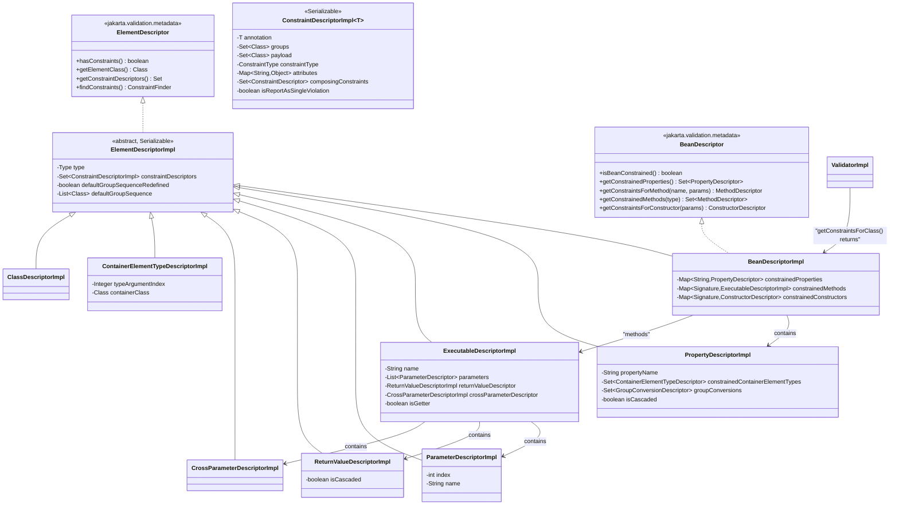
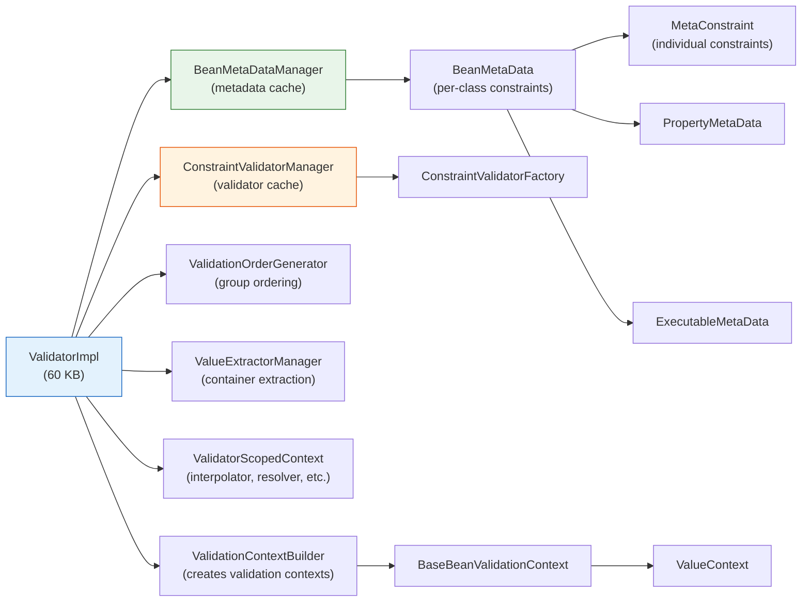
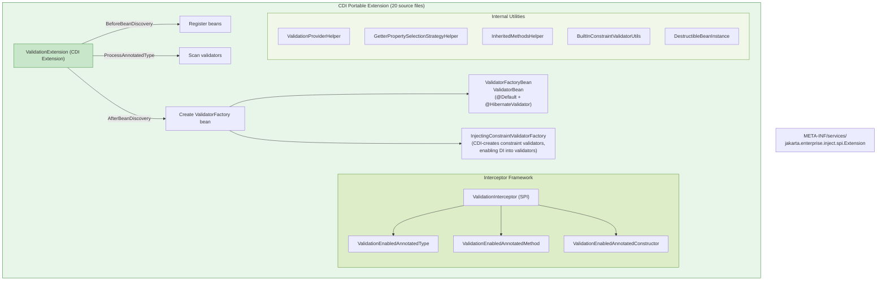
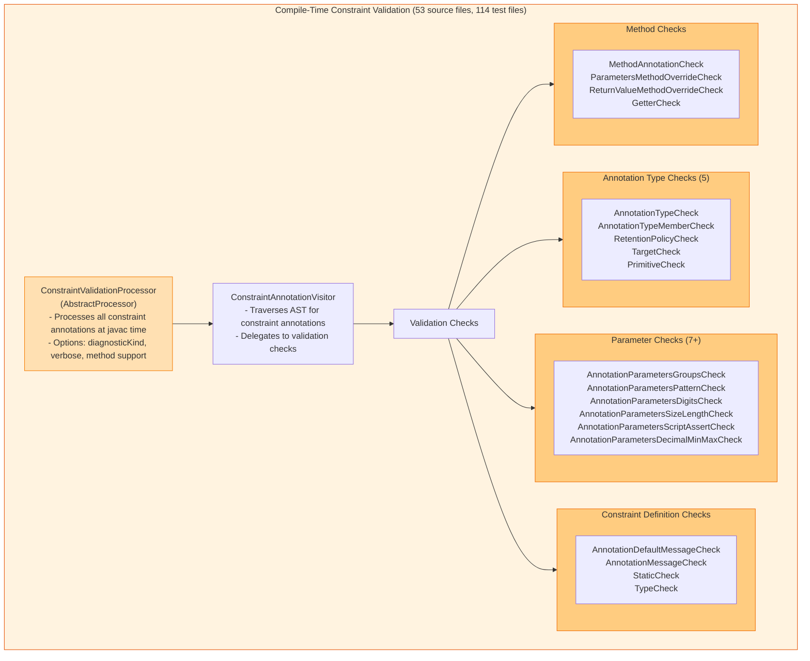
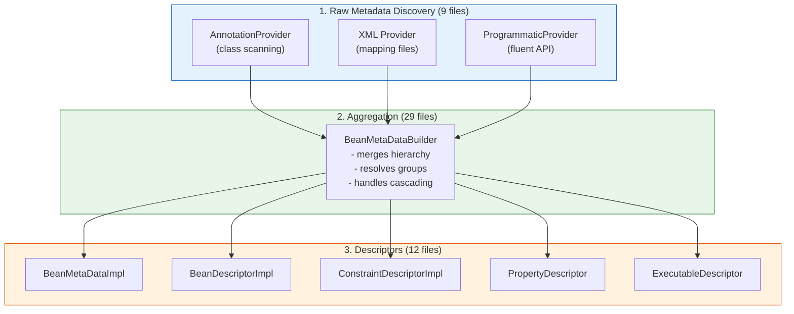
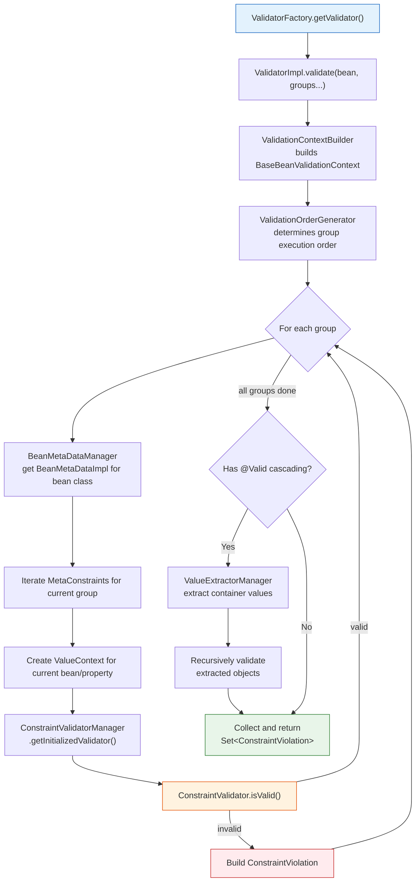

# Hibernate Validator - Architecture

## Overview

Hibernate Validator is the reference implementation of the Jakarta Bean Validation specification (currently targeting 3.1). It is a mature, full-featured validation framework with extensive support for custom constraints, CDI integration, XML configuration, and compile-time annotation processing.

**Version:** 9.2.0-SNAPSHOT
**License:** Apache 2.0
**Total Java Source Files:** 871 (engine: 798, annotation-processor: 53, cdi: 20)
**Total Test Files:** 1,048
**Engine Source Lines:** ~61,646
**Localization:** 27 languages

---

## Module Structure

```
hibernate-validator/
├── engine/                    # Core validation engine (798 source files, ~61,646 lines)
├── cdi/                       # CDI portable extension (20 source files, 45 test files)
├── annotation-processor/      # Compile-time constraint checker (53 source files, 114 test files)
├── tck-runner/                # Jakarta BV TCK compliance runner
├── test-utils/                # Shared test utilities (11 files)
├── integrationtest/           # Integration tests
│   ├── wildfly/               # WildFly server tests (51+ files)
│   └── java/modules/          # Java module system tests
│       ├── simple/            # Basic module validation
│       ├── no-el/             # EL-free environment
│       ├── cdi/               # CDI module tests
│       └── test-utils/        # Module test utilities
├── performance/               # JMH benchmarks
├── documentation/             # Generated docs (pom.xml + src)
├── build/                     # Build infrastructure
│   ├── build-config/          # Plugin & dependency management
│   ├── enforcer/              # Maven enforcer rules
│   └── reports/               # API/SPI change reports
├── parents/                   # Parent POMs
│   ├── internal/              # Internal parent
│   └── public/                # Public parent (Spotless, Checkstyle, Forbidden APIs)
├── bom/                       # Bill of Materials (hibernate-validator-bom)
└── distribution/              # Distribution packaging
```

---

## Engine Architecture Diagram

```mermaid
graph TB
    subgraph API["PUBLIC API"]
        VF["ValidatorFactory<br/>(Jakarta BV API)"]
        V["Validator<br/>(Jakarta BV API)"]
        VFI["ValidatorFactoryImpl (20 KB)<br/>- config container<br/>- thread-safe cache<br/>- creates validators"]
        VI["ValidatorImpl (60 KB)<br/>- validate()<br/>- validateProperty()<br/>- validateValue()<br/>- validateParameters()<br/>- validateReturnValue()"]
        VF --> VFI
        V --> VI
        VFI --> VI
        PSVFI["PredefinedScopeValidatorFactoryImpl (18 KB)<br/>- Pre-scoped for high-frequency validation<br/>- Limited mutability"]
    end

    subgraph META["METADATA LAYER (81 files)"]
        subgraph BMM["BeanMetaDataManager"]
            BMD["BeanMetaDataImpl<br/>- class constraints<br/>- property constraints<br/>- executable constraints<br/>- group sequences"]
            MC["MetaConstraint&lt;A&gt;<br/>- constraint location<br/>- constraint descriptor<br/>- extraction path<br/>- links to ConstraintTree"]
        end
        subgraph PROVIDERS["Metadata Providers (pluggable)"]
            AP["Annotation<br/>Provider"]
            XP["XML<br/>Provider"]
            PP["Programmatic<br/>Provider"]
        end
        subgraph LOCATIONS["Constraint Location Hierarchy (10 files)"]
            CL["Bean | Field | Getter | Parameter<br/>ReturnValue | TypeArgument<br/>CrossParameter"]
        end
        subgraph METADATA_PIPELINE["Pipeline: raw (9) -> aggregated (29) -> descriptor (12)"]
            RAW["Raw metadata from source"] --> AGG["Aggregated metadata (merged)"] --> DESC["Descriptors (final)"]
        end
    end

    subgraph ENGINE["VALIDATION ENGINE (135 files)"]
        VCB["ValidationContext<br/>Builder"] --> BBVC["BaseBeanValidation<br/>Context (11 files)<br/>- metadata refs<br/>- validator manager<br/>- message interpolator<br/>- traversable resolver<br/>- value extractor mgr"]
        CVM["ConstraintValidatorManager (16 files)<br/>- caches initialized validators<br/>- CacheKey: annotation+type+ctx<br/>- PredefinedScope variant"]
        CT["ConstraintTree<br/>- hierarchical constraint model<br/>- composition rules<br/>- matched validators per type"]
        VOG["ValidationOrderGenerator (7 files)<br/>- resolves group execution order<br/>- expands group inheritance<br/>- handles @GroupSequence"]
        VC["ValueContext (4 files)<br/>- current object<br/>- current property<br/>- cascading info"]
    end

    subgraph VALIDATORS["CONSTRAINT VALIDATORS (261 files)"]
        subgraph BV["Jakarta BV Standard"]
            BV1["@NotNull, @NotEmpty, @NotBlank<br/>@Size, @Min, @Max, @Pattern<br/>@Email, @Digits, @Past, @Future<br/>@Positive, @Negative<br/>@AssertTrue/False<br/>@DecimalMin/Max, @PastOrPresent, @FutureOrPresent"]
        end
        subgraph HV["Hibernate Extensions (26+)"]
            HV1["@CreditCardNumber, @EAN, @ISBN<br/>@BitcoinAddress, @URL, @UUID<br/>@Normalized, @UniqueElements<br/>@DurationMin/Max, @IpAddress<br/>@CodePointLength, @Length"]
            HV2["Regional: BR_CPF, BR_CNPJ,<br/>PL_NIP, PL_PESEL, PL_REGON,<br/>RU_INN, KOR_RRN"]
        end
        VE["Value Extractors (32 files)<br/>List, Map, Set, Iterable, Optional,<br/>OptionalInt/Long/Double,<br/>8 primitive arrays, Object[],<br/>JavaFX Observable/Properties"]
    end

    subgraph CROSS["CROSS-CUTTING CONCERNS"]
        MI["Message Interpolation (29 files)<br/>- TermInterpolator, parser/ (8 files)<br/>- EL resolution: el/ (8 files)<br/>- ParameterTermResolver<br/>- 27 language bundles"]
        PV["Path & Violation (5+)<br/>- MutablePath, MutableNode<br/>- ConstraintViolationImpl (9.3 KB)"]
        XML["XML Mapping (33 files)<br/>- validation.xml parsing<br/>- constraint mappings"]
        PROPS["Properties (18 files)<br/>- JavaBean property discovery"]
        UTIL["Utilities (64 files)<br/>- privileged actions<br/>- annotation processing<br/>- class hierarchy<br/>- JBoss logging<br/>- stereotypes (@Immutable, @ThreadSafe)"]
    end

    API --> META --> ENGINE --> VALIDATORS --> CROSS

    style API fill:#e3f2fd,stroke:#1565C0
    style META fill:#e8f5e9,stroke:#2E7D32
    style ENGINE fill:#fff3e0,stroke:#E65100
    style VALIDATORS fill:#f3e5f5,stroke:#7B1FA2
    style CROSS fill:#fce4ec,stroke:#C62828
    style BMM fill:#c8e6c9,stroke:#388E3C
    style PROVIDERS fill:#c8e6c9,stroke:#388E3C
    style BV fill:#e1bee7,stroke:#8E24AA
    style HV fill:#e1bee7,stroke:#8E24AA
```



---

## Jakarta Bean Validation Runtime Implementation

Hibernate Validator implements the full Jakarta BV API with extended Hibernate-specific interfaces.

### Jakarta BV API Implementation Class Hierarchy

```mermaid
classDiagram
    direction TB

    class ValidationProvider~T~ {
        <<jakarta.validation.spi>>
        +createSpecializedConfiguration(BootstrapState) T
        +createGenericConfiguration(BootstrapState) Configuration
        +buildValidatorFactory(ConfigurationState) ValidatorFactory
    }

    class HibernateValidator {
        +createSpecializedConfiguration(BootstrapState) HibernateValidatorConfiguration
        +createGenericConfiguration(BootstrapState) Configuration
        +buildValidatorFactory(ConfigurationState) ValidatorFactory
    }
    ValidationProvider <|.. HibernateValidator

    class PredefinedScopeHibernateValidator {
        +createSpecializedConfiguration(BootstrapState) PredefinedScopeHibernateValidatorConfiguration
        +buildValidatorFactory(ConfigurationState) ValidatorFactory
    }
    ValidationProvider <|.. PredefinedScopeHibernateValidator

    class Configuration~T~ {
        <<jakarta.validation>>
    }
    class ConfigurationState {
        <<jakarta.validation.spi>>
    }

    class AbstractConfigurationImpl~T~ {
        -ValidationBootstrapParameters validationBootstrapParameters
        -Set~ValueExtractor~ valueExtractorDescriptors
        -List~ConstraintMapping~ programmaticMappings
        -boolean ignoreXmlConfiguration
        +addMapping(InputStream) T
        +addProperty(name, value) T
        +buildValidatorFactory() ValidatorFactory
    }
    Configuration <|.. AbstractConfigurationImpl
    ConfigurationState <|.. AbstractConfigurationImpl

    class ConfigurationImpl {
        extends AbstractConfigurationImpl~HibernateValidatorConfiguration~
    }
    AbstractConfigurationImpl <|-- ConfigurationImpl
    HibernateValidator --> ConfigurationImpl : creates

    class PredefinedScopeConfigurationImpl {
        extends AbstractConfigurationImpl~PredefinedScopeHibernateValidatorConfiguration~
    }
    AbstractConfigurationImpl <|-- PredefinedScopeConfigurationImpl
    PredefinedScopeHibernateValidator --> PredefinedScopeConfigurationImpl : creates

    class ValidatorFactory {
        <<jakarta.validation>>
        +getValidator() Validator
        +getMessageInterpolator() MessageInterpolator
        +getConstraintValidatorFactory() ConstraintValidatorFactory
        +close()
    }

    class HibernateValidatorFactory {
        <<org.hibernate.validator>>
        +usingContext() HibernateValidatorContext
    }
    ValidatorFactory <|-- HibernateValidatorFactory

    class ValidatorFactoryImpl {
        -ValidatorFactoryScopedContext validatorFactoryScopedContext
        -BeanMetaDataManager beanMetaDataManager
        -ConstraintValidatorManager constraintValidatorManager
        -ValidationOrderGenerator validationOrderGenerator
        -ValueExtractorManager valueExtractorManager
        +getValidator() Validator
        +usingContext() HibernateValidatorContext
        +close()
    }
    HibernateValidatorFactory <|.. ValidatorFactoryImpl
    HibernateValidator --> ValidatorFactoryImpl : creates

    class PredefinedScopeValidatorFactoryImpl {
        -BeanMetaDataManager beanMetaDataManager
        -ConstraintValidatorManager constraintValidatorManager
        +getValidator() Validator
    }
    HibernateValidatorFactory <|.. PredefinedScopeValidatorFactoryImpl : "PredefinedScope variant"
    PredefinedScopeHibernateValidator --> PredefinedScopeValidatorFactoryImpl : creates

    class Validator {
        <<jakarta.validation>>
        +validate(object, groups) Set~ConstraintViolation~
        +validateProperty(object, propertyName, groups) Set~ConstraintViolation~
        +validateValue(beanType, propertyName, value, groups) Set~ConstraintViolation~
        +getConstraintsForClass(clazz) BeanDescriptor
        +forExecutables() ExecutableValidator
    }
    class ExecutableValidator {
        <<jakarta.validation.executable>>
        +validateParameters(object, method, params, groups) Set~ConstraintViolation~
        +validateReturnValue(object, method, returnValue, groups) Set~ConstraintViolation~
    }

    class ValidatorImpl {
        -ValidationOrderGenerator validationOrderGenerator
        -ConstraintValidatorFactory constraintValidatorFactory
        -BeanMetaDataManager beanMetaDataManager
        -ConstraintValidatorManager constraintValidatorManager
        -ValueExtractorManager valueExtractorManager
        -ValidatorScopedContext validatorScopedContext
        +validate(object, groups) Set~ConstraintViolation~
        +getConstraintsForClass(clazz) BeanDescriptor
        +forExecutables() ExecutableValidator
    }
    Validator <|.. ValidatorImpl
    ExecutableValidator <|.. ValidatorImpl
    ValidatorFactoryImpl --> ValidatorImpl : creates
    PredefinedScopeValidatorFactoryImpl --> ValidatorImpl : creates

    class ConstraintValidatorFactory {
        <<jakarta.validation>>
        +getInstance(key) ConstraintValidator
        +releaseInstance(instance)
    }

    class DefaultConstraintValidatorFactory {
        +getInstance(key) ConstraintValidator
    }
    ConstraintValidatorFactory <|.. DefaultConstraintValidatorFactory

    class ConstraintValidatorManager {
        <<interface>>
        +getInitializedValidator(type, descriptor, factory, ctx) ConstraintValidator
        +clear()
    }
    ValidatorImpl --> ConstraintValidatorManager : uses
    ValidatorImpl --> BeanMetaDataManager : uses

    class BeanMetaDataManager {
        <<interface>>
        +getBeanMetaData(beanClass) BeanMetaData
    }
    class BeanMetaDataManagerImpl {
        -ConstraintHelper constraintHelper
        -List~MetaDataProvider~ metaDataProviders
        -ConcurrentMap beanMetaDataCache
    }
    BeanMetaDataManager <|.. BeanMetaDataManagerImpl
    ValidatorFactoryImpl --> BeanMetaDataManagerImpl : creates
```



### Descriptor Class Hierarchy (org.hibernate.validator.internal.metadata.descriptor)



### Key Implementation Details

| Jakarta BV Interface | Hibernate Validator Implementation | Key Characteristics |
|---|---|---|
| `ValidationProvider` | `HibernateValidator` (38 lines) | SPI entry point, registered in META-INF/services |
| `ValidationProvider` | `PredefinedScopeHibernateValidator` | Optimized for known-scope validation |
| `Configuration` | `AbstractConfigurationImpl` (32 KB) | Base with full XML + programmatic support |
| `Configuration` | `ConfigurationImpl` | Standard HV configuration |
| `Configuration` | `PredefinedScopeConfigurationImpl` | Pre-scoped configuration |
| `ValidatorFactory` | `ValidatorFactoryImpl` (20 KB) | Thread-safe, manages all subsystems |
| `ValidatorFactory` | `PredefinedScopeValidatorFactoryImpl` (18 KB) | Pre-built metadata, no dynamic expansion |
| `Validator` + `ExecutableValidator` | `ValidatorImpl` (60 KB) | Full validation engine, group ordering, cascading |
| `ConstraintValidatorFactory` | `DefaultConstraintValidatorFactory` | Reflection-based instantiation |
| `BeanDescriptor` | `BeanDescriptorImpl` (128 lines) | Immutable, extends `ElementDescriptorImpl` |
| `PropertyDescriptor` | `PropertyDescriptorImpl` | With cascading and container element support |
| `MethodDescriptor` | `ExecutableDescriptorImpl` | Shared with constructors, has isGetter flag |
| `ConstraintDescriptor` | `ConstraintDescriptorImpl` (Serializable) | Full composition support, constraint type enum |
| `ValidatorContext` | `ValidatorContextImpl` | Customizes per-validator settings |

### ValidatorImpl Internal Dependencies



---

## Engine Internal Package Breakdown

| Package | Files | Purpose |
|---------|-------|---------|
| `internal/engine/constraintvalidation/` | 16 | Constraint validator caching, initialization, management |
| `internal/engine/messageinterpolation/` | 29 | Message parsing, EL resolution, parameter substitution |
| `internal/engine/valueextraction/` | 32 | Container value extraction (26 built-in extractors) |
| `internal/engine/validationcontext/` | 11 | Validation context builders and implementations |
| `internal/engine/groups/` | 7 | Group ordering, inheritance, @GroupSequence |
| `internal/engine/resolver/` | 6 | Traversable resolver implementation |
| `internal/engine/path/` | 5 | Property path construction |
| `internal/engine/valuecontext/` | 4 | Value context for current validation target |
| `internal/engine/tracking/` | 3 | Bean processing tracking |
| `internal/engine/scripting/` | 2 | Script evaluation engine |
| `internal/engine/constraintdefinition/` | 1 | Constraint definition handling |
| `internal/metadata/aggregated/` | 29 | Aggregated metadata (Bean, Property, Executable, Parameter, ReturnValue, Cascading) |
| `internal/metadata/descriptor/` | 12 | Constraint descriptors (final, immutable) |
| `internal/metadata/location/` | 10 | Constraint location tracking |
| `internal/metadata/raw/` | 9 | Raw metadata from annotations |
| `internal/metadata/core/` | 8 | Core metadata structures, ConstraintHelper |
| `internal/metadata/provider/` | 5 | Metadata providers (Annotation, XML, Programmatic) |
| `internal/metadata/facets/` | 3 | Metadata facet interfaces |
| `internal/constraintvalidators/bv/` | 235+ | Jakarta BV standard validators (Number, Size, Time, Pattern, etc.) |
| `internal/constraintvalidators/hv/` | 26+ | Hibernate extended validators |
| `internal/xml/` | 33 | XML constraint mapping and configuration parsing |
| `internal/util/` | 64 | Utilities, logging, privileged actions, annotation processing |
| `internal/properties/` | 18 | JavaBean property discovery |
| `internal/cfg/` | 20 | Configuration implementation |

---

## CDI Module Architecture



---

## Annotation Processor Module



---

## Key Design Patterns

### 1. Provider Pattern
Metadata sources are pluggable via `MetaDataProvider`:
- `AnnotationMetaDataProvider` - Scans Java annotations
- `XmlMetaDataProvider` - Parses XML constraint mappings
- `ProgrammaticMetaDataProvider` - Handles fluent API constraints

### 2. Factory Pattern
- `ValidatorFactoryImpl` creates `Validator` instances
- `ConstraintValidatorFactory` creates constraint validators
- `ScriptEvaluatorFactory` creates script evaluators

### 3. Strategy Pattern
Key extension points are strategy interfaces:
- `TraversableResolver` - Controls object graph traversal
- `MessageInterpolator` - Pluggable message resolution
- `PropertyNodeNameProvider` - Custom property naming
- `GetterPropertySelectionStrategy` - Property detection strategy
- `ConstraintValidatorFactory` - Validator creation strategy

### 4. Visitor Pattern
- `ElementVisitor` for AST traversal in the annotation processor
- `ConstraintAnnotationVisitor` processes constraint annotations
- Value extraction uses a visitor-like traversal pattern

### 5. Caching / Thread-Safety
- `ValidatorFactoryImpl` uses `ConcurrentHashMap` for thread-safe caching
- `ConstraintValidatorManagerImpl` caches initialized validators by composite key
- `ValidationOrderGenerator` caches resolved group sequences
- Annotations: `@Immutable`, `@ThreadSafe` used for documentation
- `PredefinedScopeValidatorFactoryImpl` provides optimized caching for known-scope validation

### 6. SPI (Service Provider Interface)
Packages under `org.hibernate.validator.spi.*` define extension points:
- `spi.cfg` - Configuration (`ConstraintMappingContributor`)
- `spi.group` - Group sequence providers (`DefaultGroupSequenceProvider`)
- `spi.messageinterpolation` - Custom message interpolation (`LocaleResolver`)
- `spi.scripting` - Script evaluation (`ScriptEvaluatorFactory`, `AbstractCachingScriptEvaluatorFactory`)
- `spi.properties` - Property selection (`GetterPropertySelectionStrategy`)
- `spi.nodenameprovider` - Property naming (`PropertyNodeNameProvider`)
- `spi.resourceloading` - Resource loading (`ResourceBundleLocator`)
- `spi.tracking` - Bean processing tracking (`ProcessedBeansTrackingVoter`)

---

## Metadata Aggregation Pipeline



---

## Core Validation Flow



---

## Built-in Constraint Validators Summary

### Jakarta BV Standard Validators
- **Boolean:** `@AssertTrue`, `@AssertFalse`
- **Null checks:** `@NotNull`, `@Null`, `@NotEmpty`, `@NotBlank`
- **String:** `@Pattern`, `@Email`
- **Size:** `@Size`, `@Digits`
- **Number:** `@Min`, `@Max`, `@DecimalMin`, `@DecimalMax`, `@Positive`, `@PositiveOrZero`, `@Negative`, `@NegativeOrZero`
- **Temporal:** `@Past`, `@PastOrPresent`, `@Future`, `@FutureOrPresent` (8 variants each for different date/time types)

### Hibernate Extended Validators (26+)
- **Generic:** `@UniqueElements`, `@Normalized`, `@CodePointLength`, `@Length`
- **String/Network:** `@URL`, `@UUID`, `@IpAddress`, `@Email` (extended)
- **Financial:** `@CreditCardNumber` (`LuhnCheck`, `Mod10Check`, `Mod11Check`), `@BitcoinAddress`
- **Document:** `@EAN`, `@ISBN`
- **Duration:** `@DurationMin`, `@DurationMax`
- **Script:** `@ScriptAssert`, `@ParameterScriptAssert`
- **Regional:** BR (`@CPF`, `@CNPJ`), PL (`@PESEL`, `@NIP`, `@REGON`), RU (`@INN`), KOR (`@KorRRN`)

---

## Key Dependencies

- Jakarta Validation API 3.1
- Jakarta EL (Expressly 6.0.0) - for message interpolation
- JBoss Logging 3.6.3
- ParaNamer 2.8.3 - parameter name detection
- Jakarta CDI API (for CDI module)
- WildFly 39.0.1 (for integration testing)
- SPI registration: `META-INF/services/jakarta.validation.spi.ValidationProvider` -> `org.hibernate.validator.HibernateValidator`
