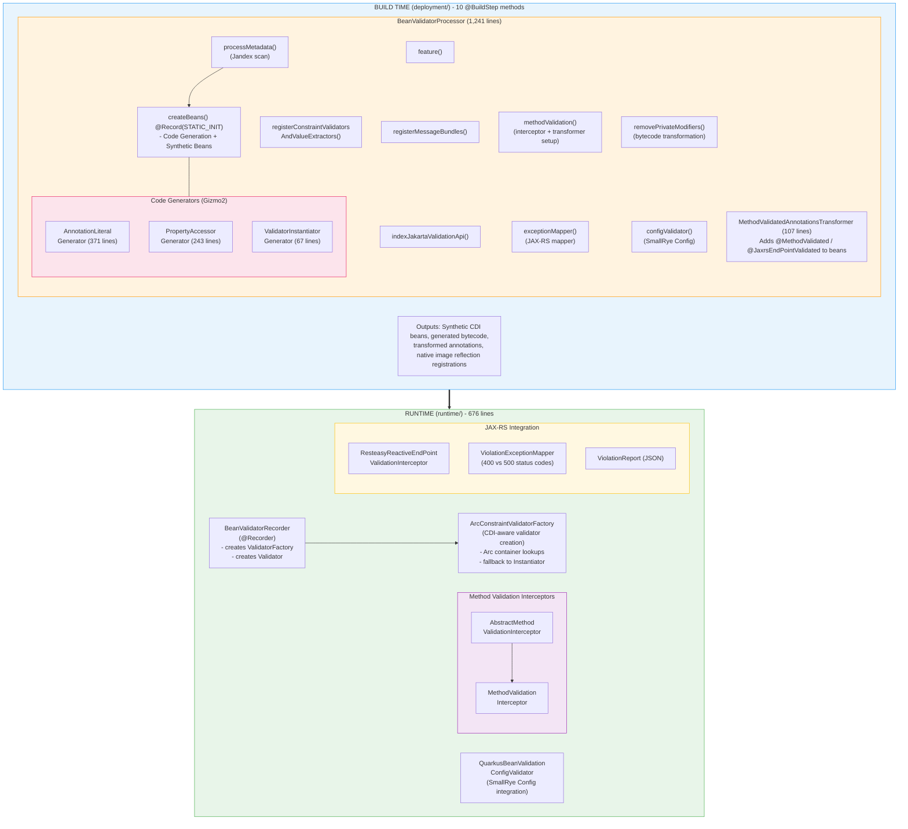
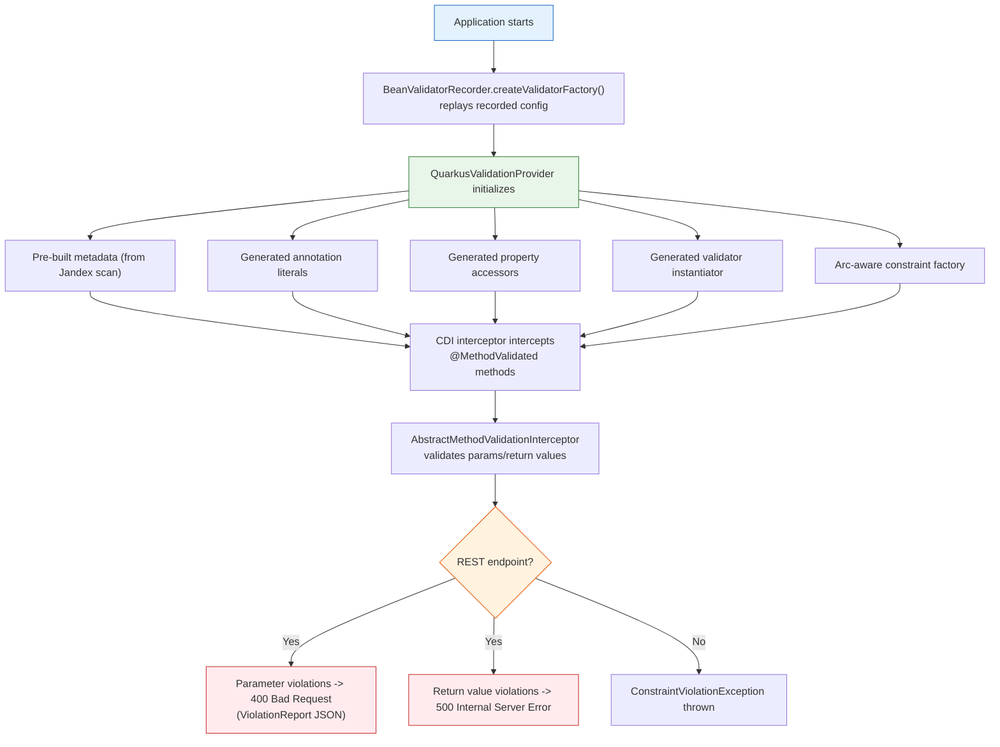

# Quarkus Bean Validator Extension - Architecture

## Overview

The Quarkus Bean Validator extension integrates Jakarta Bean Validation 2.0+ into the Quarkus framework. It follows Quarkus's build-time processing philosophy: metadata is extracted, bytecode is generated, and reflection is eliminated at compile time, resulting in fast startup and low memory footprint - especially for GraalVM native images.

**Extension Status:** Experimental
**Artifact:** `io.quarkus:quarkus-bean-validator:999-SNAPSHOT`
**Total Codebase Size:** 2,746 lines of Java (runtime: 676, deployment: 2,070)
**Test Code:** 1,928 lines across 35 test files
**Minimum Java Version:** 17
**Capabilities Provided:** `io.quarkus.bean.validator`
**Extension Dependencies:** `quarkus-core`, `quarkus-arc`

---

## Module Structure

```
bean-validator/
├── pom.xml                  # Parent POM aggregating both modules
├── deployment/              # Build-time processing (compile only)
│   └── src/
│       ├── main/java/
│       │   └── io/quarkus/bean/validator/deployment/
│       │       ├── BeanValidatorProcessor.java              (1,241 lines)
│       │       ├── ConstraintAnnotationLiteralGenerator.java (371 lines)
│       │       ├── PropertyAccessorGenerator.java            (243 lines)
│       │       ├── MethodValidatedAnnotationsTransformer.java(107 lines)
│       │       ├── ValidatorInstantiatorGenerator.java       (67 lines)
│       │       └── SimpleMethodSignatureKey.java             (41 lines)
│       └── test/
│           ├── java/    # 35 test files (1,928 lines)
│           └── resources/
│               ├── application.properties
│               ├── application-mappings-validation.properties
│               ├── ValidationMessages.properties
│               └── ValidationMessages_fr_FR.properties
└── runtime/                 # Runtime classes (shipped in app)
    └── src/main/
        ├── java/
        │   └── io/quarkus/bean/validator/runtime/
        │       ├── ArcConstraintValidatorFactory.java        (54 lines)
        │       ├── BeanValidatorRecorder.java                (74 lines)
        │       ├── QuarkusBeanValidationConfigValidator.java  (63 lines)
        │       ├── interceptor/
        │       │   ├── AbstractMethodValidationInterceptor.java (113 lines)
        │       │   ├── MethodValidated.java                     (17 lines)
        │       │   └── MethodValidationInterceptor.java         (25 lines)
        │       └── jaxrs/
        │           ├── JaxrsEndPointValidated.java                        (20 lines)
        │           ├── ResteasyReactiveEndPointValidationInterceptor.java  (32 lines)
        │           ├── ResteasyReactiveViolationException.java             (26 lines)
        │           ├── ResteasyReactiveViolationExceptionMapper.java       (100 lines)
        │           ├── ValidatorMediaTypeUtil.java                         (57 lines)
        │           └── ViolationReport.java                               (95 lines)
        └── resources/
            └── META-INF/quarkus-extension.yaml
```

---

## Architecture Diagram



---

## @BuildStep Methods Detail

The `BeanValidatorProcessor` contains 10 `@BuildStep` methods executed during the Quarkus build:

| # | Method | Line | Produces | Consumes | Purpose |
|---|--------|------|----------|----------|---------|
| 1 | `feature()` | 112 | `FeatureBuildItem` | - | Registers the extension feature |
| 2 | `registerMessageBundles()` | 117 | `NativeImageResourceBundleBuildItem` | - | Registers ValidationMessages bundles for native image |
| 3 | `indexJakartaValidationApi()` | 124 | `IndexDependencyBuildItem` | - | Adds jakarta.validation-api to Jandex index |
| 4 | `processMetadata()` | 129 | `BeanValidationMetadataBuildItem` | `CombinedIndexBuildItem` | Scans application for constraint metadata via Jandex |
| 5 | `registerConstraintValidatorsAndValueExtractors()` | 136 | `AdditionalBeanBuildItem` | `CombinedIndexBuildItem` | Registers all ConstraintValidator and ValueExtractor implementations as CDI beans |
| 6 | `createBeans()` | 153 | `SyntheticBeanBuildItem`, `GeneratedClassBuildItem`, `ReflectiveClassBuildItem` | `BeanValidationMetadataBuildItem`, `CombinedIndexBuildItem` | Core step: generates bytecode, registers synthetic ValidatorFactory and Validator beans |
| 7 | `methodValidation()` | 215 | `AdditionalBeanBuildItem`, `AnnotationsTransformerBuildItem` | `CombinedIndexBuildItem`, `Capabilities` | Registers method validation interceptors and annotation transformer |
| 8 | `exceptionMapper()` | 244 | `ExceptionMapperBuildItem`, `ReflectiveClassBuildItem` | `Capabilities` | Registers REST exception mapper (conditional on ResteasyReactive) |
| 9 | `removePrivateModifiers()` | 264 | `BytecodeTransformerBuildItem` | `CombinedIndexBuildItem`, `BeanValidationMetadataBuildItem` | Removes `private` from constrained fields/getters for native image |
| 10 | `configValidator()` | 406 | `GeneratedClassBuildItem`, `StaticInitConfigBuilderBuildItem`, `RunTimeConfigBuilderBuildItem` | `ConfigClassBuildItem`, `BeanValidationMetadataBuildItem` | Generates config validators for @ConfigMapping interfaces |

---

## Key Architectural Patterns

### 1. Build-Time Processing (Quarkus Extension Pattern)

The extension follows the standard Quarkus deployment/runtime split:

- **Deployment module**: Contains `@BuildStep` methods that run during `mvn compile` / `quarkus:dev`. These scan the application, generate bytecode, and produce `BuildItem` objects consumed by other build steps.
- **Runtime module**: Contains `@Recorder` classes whose methods are recorded at build time and replayed at startup.
- **Build Items**: `BeanValidationMetadataBuildItem` carries the constraint metadata tree between build steps.

### 2. Reflection-Free Code Generation (Gizmo2)

Three generators eliminate runtime reflection for GraalVM native compatibility:

| Generator | Purpose | Output |
|-----------|---------|--------|
| `ConstraintAnnotationLiteralGenerator` | Creates concrete annotation implementations | One class per constraint annotation type |
| `PropertyAccessorGenerator` | Creates direct field/method accessors | One class per constrained bean |
| `ValidatorInstantiatorGenerator` | Creates direct constructor calls | Single class with switch statement |

### 3. CDI Integration via Arc

- `ArcConstraintValidatorFactory` resolves constraint validators from the CDI container
- `ValidatorFactory` and `Validator` are registered as synthetic CDI beans (both `SINGLETON` scope, `unremovable`)
- Method validation is implemented via CDI interceptors (`@MethodValidated`, `@JaxrsEndPointValidated`)
- Constraint validators and value extractors are registered as `AdditionalBeanBuildItem`s (also `unremovable`)

### 4. Bytecode Transformation

The `removePrivateModifiers()` build step transforms constrained classes at compile time, removing `private` modifiers from constrained fields and getter methods. This avoids the need for `setAccessible()` calls at runtime, which is critical for native image support.

### 5. Conditional Integration

The extension conditionally integrates with:
- **ResteasyReactive**: If present, registers REST endpoint interceptors and exception mappers (checked via `Capability.RESTEASY_REACTIVE`)
- **SmallRye Config**: If present, generates config validators for `@ConfigMapping` interfaces
- **ResteasyClassic**: Also checked for JAX-RS method scanning (`Capability.RESTEASY`)

---

## Build Output Analysis

The build produces the following artifacts in `target/`:

### Runtime Module (`runtime/target/classes/`)
```
META-INF/
├── quarkus-extension.yaml          # Extension descriptor
└── quarkus-extension.properties    # Extension properties

io/quarkus/bean/validator/runtime/
├── ArcConstraintValidatorFactory.class
├── BeanValidatorRecorder.class
├── BeanValidatorRecorder$1.class   # Anonymous class (ValidatorFactory supplier)
├── BeanValidatorRecorder$2.class   # Anonymous class (Validator supplier)
├── QuarkusBeanValidationConfigValidator.class
├── interceptor/
│   ├── AbstractMethodValidationInterceptor.class
│   ├── MethodValidationInterceptor.class
│   └── MethodValidated.class
└── jaxrs/
    ├── JaxrsEndPointValidated.class
    ├── ResteasyReactiveEndPointValidationInterceptor.class
    ├── ResteasyReactiveViolationException.class
    ├── ResteasyReactiveViolationExceptionMapper.class
    ├── ValidatorMediaTypeUtil.class
    ├── ViolationReport.class
    └── ViolationReport$Violation.class
```

### Deployment Module (`deployment/target/`)
- Compiled build step classes (not shipped in application)
- Test classes include inner classes for test beans, constraints, and validators

---

## Validation Flow



---

## Test Coverage

35 test files organized by category (1,928 lines total):

| Category | Files | Key Tests |
|----------|-------|-----------|
| Core validation | 4 | `BasicValidationTest` (99), `CascadingValidationTest` (82), `ClassHierarchyTest` (63), `RepeatedConstraintsTest` (109) |
| Container elements | 1 | `ContainerElementConstraintsTest` (114) |
| Method validation | 1 | `ConstraintOnStaticMethodTest` (34) |
| Value extractors | 3 | `SingletonCustomValueExtractorTest`, `ApplicationScopedCustomValueExtractorTest`, `NestedContainerTypeCustomValueExtractorTest` |
| Config mapping | 3 | `ConfigMappingInvalidTest` (232), `ConfigMappingValidatorTest` (40), `ConfigMappingInjectionInValidatorTest` (75) |
| REST integration | 2 | `RestEndPointValidationTest` (116), `CdiBeanMethodValidationFromRestTest` (64) |
| Dev mode | 2 | `BeanValidatorDevModeTest` (130), `DevModeConstraintValidationTest` (115) |
| Locale | 2 | `UserCountryNotSetValidatorLocaleTest` (58), `ConstraintValidatorLocalesTest` (43) |
| CDI injection | 3 | `ValidatorBeanInjectionTest` (44), `ValidatorFromValidationTest` (42), `ValidatorForEarlyInitializedBeanTest` (56) |
| Support files | 14 | Test beans, constraints, validators, and routes |

---

## Dependencies

### Runtime Dependencies
- `quarkus-core` - Quarkus runtime framework
- `quarkus-arc` - CDI container (ArC)
- `io.quarkus.bean-validation:bean-validation` - Bean validation processor/implementation
- `smallrye-config-validator` - Config mapping validation
- `jakarta.ws.rs-api` (optional) - JAX-RS API
- `resteasy-reactive` (optional) - RESTEasy Reactive

### Deployment Dependencies
- `quarkus-core-deployment` - Build-time framework (Jandex, Gizmo, BuildStep API)
- `quarkus-arc-deployment` - CDI processing
- `bean-validation-processor` - Bean validation metadata processing
- `quarkus-resteasy-common-spi` / `quarkus-rest-spi-deployment` - REST integration SPIs

### Configuration Files
- `quarkus-extension.yaml` - Extension descriptor with metadata, categories (`web`, `data`), keywords, capabilities
- `application.properties` (test) - Locale configuration (`quarkus.locales=en,en-US,fr-FR`, `quarkus.default-locale=fr-FR`)
- `application-mappings-validation.properties` (test) - Config mapping validation test data
- `ValidationMessages.properties` / `ValidationMessages_fr_FR.properties` (test) - Custom validation messages
