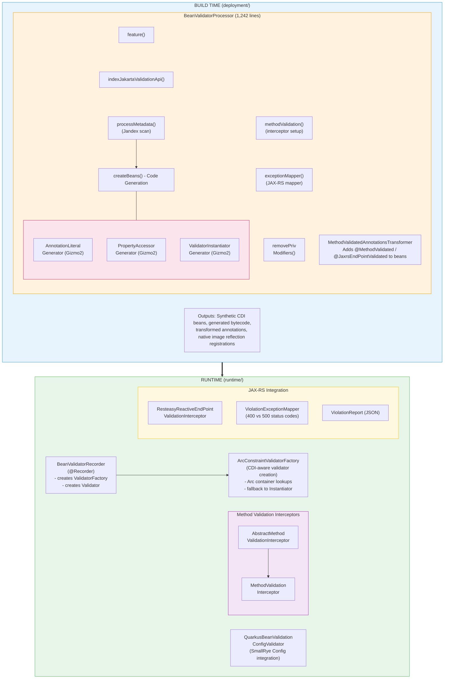

# Quarkus Bean Validator Extension - Architecture

## Overview

The Quarkus Bean Validator extension integrates Jakarta Bean Validation 2.0+ into the Quarkus framework. It follows Quarkus's build-time processing philosophy: metadata is extracted, bytecode is generated, and reflection is eliminated at compile time, resulting in fast startup and low memory footprint - especially for GraalVM native images.

**Total Codebase Size:** ~2,746 lines of Java (runtime: 676, deployment: 2,070)
**Test Code:** ~1,928 lines across 36 test files

---

## Module Structure

```
bean-validator/
├── pom.xml                  # Parent POM aggregating both modules
├── deployment/              # Build-time processing (compile only)
│   └── src/main/java/
│       └── io/quarkus/bean/validator/deployment/
│           ├── BeanValidatorProcessor.java              (1,242 lines)
│           ├── ConstraintAnnotationLiteralGenerator.java (372 lines)
│           ├── PropertyAccessorGenerator.java            (244 lines)
│           ├── ValidatorInstantiatorGenerator.java       (68 lines)
│           ├── MethodValidatedAnnotationsTransformer.java(108 lines)
│           └── SimpleMethodSignatureKey.java             (42 lines)
└── runtime/                 # Runtime classes (shipped in app)
    └── src/main/java/
        └── io/quarkus/bean/validator/runtime/
            ├── ArcConstraintValidatorFactory.java        (55 lines)
            ├── BeanValidatorRecorder.java                (75 lines)
            ├── QuarkusBeanValidationConfigValidator.java  (64 lines)
            ├── interceptor/
            │   ├── AbstractMethodValidationInterceptor.java (114 lines)
            │   ├── MethodValidated.java                     (18 lines)
            │   └── MethodValidationInterceptor.java         (26 lines)
            └── jaxrs/
                ├── JaxrsEndPointValidated.java                        (21 lines)
                ├── ResteasyReactiveEndPointValidationInterceptor.java  (33 lines)
                ├── ResteasyReactiveViolationException.java             (27 lines)
                ├── ResteasyReactiveViolationExceptionMapper.java       (101 lines)
                ├── ValidatorMediaTypeUtil.java                         (58 lines)
                └── ViolationReport.java                               (96 lines)
```

---

## Architecture Diagram



---

## Key Architectural Patterns

### 1. Build-Time Processing (Quarkus Extension Pattern)

The extension follows the standard Quarkus deployment/runtime split:

- **Deployment module**: Contains `@BuildStep` methods that run during `mvn compile` / `quarkus:dev`. These scan the application, generate bytecode, and produce `BuildItem` objects consumed by other build steps.
- **Runtime module**: Contains `@Recorder` classes whose methods are recorded at build time and replayed at startup.
- **Build Items**: `BeanValidationMetadataBuildItem` carries the constraint metadata tree between build steps.

### 2. Reflection-Free Code Generation (Gizmo2)

Three generators eliminate runtime reflection for GraalVM native compatibility:

| Generator | Purpose | Output |
|-----------|---------|--------|
| `ConstraintAnnotationLiteralGenerator` | Creates concrete annotation implementations | One class per constraint annotation type |
| `PropertyAccessorGenerator` | Creates direct field/method accessors | One class per constrained bean |
| `ValidatorInstantiatorGenerator` | Creates direct constructor calls | Single class with switch statement |

### 3. CDI Integration via Arc

- `ArcConstraintValidatorFactory` resolves constraint validators from the CDI container
- `ValidatorFactory` and `Validator` are registered as synthetic CDI beans
- Method validation is implemented via CDI interceptors (`@MethodValidated`, `@JaxrsEndPointValidated`)
- Constraint validators and value extractors are registered as `AdditionalBeanBuildItem`s

### 4. Bytecode Transformation

The `removePrivateModifiers()` build step transforms constrained classes at compile time, removing `private` modifiers from constrained fields. This avoids the need for `setAccessible()` calls at runtime, which is critical for native image support.

### 5. Conditional Integration

The extension conditionally integrates with:
- **ResteasyReactive**: If present, registers REST endpoint interceptors and exception mappers
- **SmallRye Config**: If present, generates config validators for `@ConfigMapping` interfaces

---

## Validation Flow


---

## Dependencies

### Runtime Dependencies
- `quarkus-core` - Quarkus runtime framework
- `quarkus-arc` - CDI container (ArC)
- `io.quarkus.bean-validation:bean-validation` - Bean validation processor/implementation
- `smallrye-config-validator` - Config mapping validation
- `jakarta.ws.rs-api` (optional) - JAX-RS API
- `resteasy-reactive` (optional) - RESTEasy Reactive

### Deployment Dependencies
- `quarkus-core-deployment` - Build-time framework (Jandex, Gizmo, BuildStep API)
- `quarkus-arc-deployment` - CDI processing
- `bean-validation-processor` - Bean validation metadata processing
- `quarkus-resteasy-common-spi` / `quarkus-rest-spi-deployment` - REST integration SPIs
