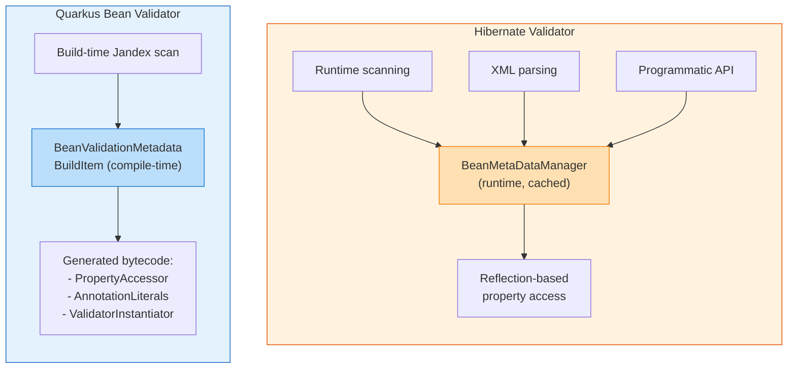
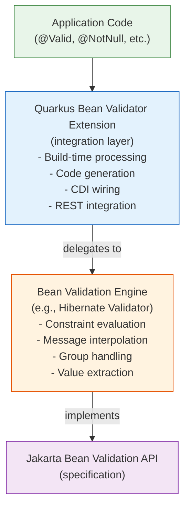

# Codebase Comparison: Quarkus Bean Validator vs Hibernate Validator

## Purpose and Relationship

These two projects serve different but complementary roles in the Jakarta Bean Validation ecosystem:

- **Hibernate Validator** is the **reference implementation** of the Jakarta Bean Validation specification. It is a standalone, full-featured validation engine.
- **Quarkus Bean Validator** is an **integration layer** that adapts Hibernate Validator (or a similar validation engine) for the Quarkus runtime, optimizing it for fast startup, low memory, and GraalVM native image compatibility.

They are not competing implementations - Quarkus Bean Validator wraps and enhances a validation engine for use within Quarkus.

---

## Scale Comparison

| Metric | Quarkus Bean Validator | Hibernate Validator |
|--------|----------------------|---------------------|
| Total Java files | ~17 (main) | ~1,092 (main) |
| Lines of code (main) | ~2,746 | ~100,000+ (estimated) |
| Test files | 36 | ~650+ |
| Modules | 2 (deployment + runtime) | 8+ (engine, cdi, annotation-processor, etc.) |
| External dependencies | ~6 | ~10+ |
| Spec version targeted | Jakarta BV 2.0+ | Jakarta BV 3.1 |

---

## Architectural Comparison

### Design Philosophy

| Aspect | Quarkus Bean Validator | Hibernate Validator |
|--------|----------------------|---------------------|
| **Processing time** | Build-time (compile) | Runtime |
| **Reflection usage** | Eliminated via code generation | Heavy use of reflection |
| **Metadata discovery** | Jandex index scanning at build time | Runtime class scanning |
| **CDI integration** | Built into framework (Arc) | Portable CDI extension |
| **Configuration** | Build-time config + recorders | Runtime XML + programmatic API |
| **Native image** | First-class GraalVM support | Requires additional configuration |
| **Startup time** | Optimized (pre-computed metadata) | Standard (runtime initialization) |

### Metadata Handling

**Hibernate Validator** discovers and aggregates metadata at runtime from multiple sources (annotations, XML, programmatic API). It uses reflection to access bean properties and create constraint validator instances.

**Quarkus Bean Validator** performs metadata discovery once at build time using Jandex (a bytecode index). It generates concrete Java classes (via Gizmo2) that replace reflection-based operations, enabling native image compilation and faster startup.

### CDI Integration

| Aspect | Quarkus (Arc) | Hibernate Validator (CDI Extension) |
|--------|--------------|--------------------------------------|
| Extension mechanism | `@BuildStep` processors | CDI Portable Extension |
| Bean registration | Synthetic CDI beans at build time | Runtime AfterBeanDiscovery |
| Interceptors | Arc interceptors with annotation transformers | Manual interceptor binding |
| Validator creation | `ArcConstraintValidatorFactory` | `InjectingConstraintValidatorFactory` |
| Lifecycle | Build-time wiring, runtime execution | Full runtime lifecycle |

### Method Validation

Both implement method-level validation via CDI interceptors, but differently:

**Hibernate Validator:**
- Uses standard CDI interceptor binding
- `@ValidateOnExecution` annotation controls which methods are validated
- Interceptor discovers constraints at runtime

**Quarkus Bean Validator:**
- `MethodValidatedAnnotationsTransformer` adds interceptor bindings at build time
- Separate bindings for regular methods (`@MethodValidated`) and REST endpoints (`@JaxrsEndPointValidated`)
- REST-specific interceptor wraps violations as `ResteasyReactiveViolationException` for proper HTTP status codes

### REST Integration

| Feature | Quarkus Bean Validator | Hibernate Validator |
|---------|----------------------|---------------------|
| REST framework | ResteasyReactive (optional) | None (left to integrators) |
| Exception mapping | Built-in `ViolationExceptionMapper` | Not included |
| Status code handling | 400 for param violations, 500 for return | Not applicable |
| Error response format | Zalando Problem-style JSON | Not applicable |

Quarkus provides out-of-the-box REST error handling, while Hibernate Validator leaves this to the application or framework.

### Configuration Validation

**Quarkus** uniquely provides SmallRye Config integration:
- `QuarkusBeanValidationConfigValidator` validates `@ConfigMapping` interfaces
- Pre-built metadata eliminates runtime reflection for config validation
- Config is validated at startup before the application starts

**Hibernate Validator** does not include framework-specific config validation.

---

## Feature Matrix

| Feature | Quarkus BV | Hibernate Validator |
|---------|-----------|---------------------|
| Field validation | Delegated | Full implementation |
| Method validation | CDI interceptors | CDI interceptors |
| Constructor validation | CDI interceptors | Direct API |
| Group sequences | Delegated | Full implementation |
| Custom constraints | Supported via CDI | Full support |
| Constraint composition | Delegated | Full implementation |
| XML constraint mapping | Not supported | Full support |
| Programmatic constraint API | Not exposed | Full fluent API |
| Value extractors | Supported | Full implementation |
| Message interpolation | Delegated | Full engine with EL support |
| Compile-time annotation checking | No | Yes (annotation-processor) |
| GraalVM native image | First-class | Requires manual config |
| Dev mode / live reload | Built-in | Not applicable |
| Config mapping validation | Yes (SmallRye) | No |
| REST error responses | Built-in | Not included |
| Locale support | Build-time configured | Runtime configured |
| Custom TraversableResolver | Delegated | Full SPI |
| Script-based constraints | Not exposed | @ScriptAssert support |
| Regional validators | Delegated | CPF, CNPJ, NIP, INN, etc. |
| Performance benchmarks | No | JMH benchmark suite |
| TCK compliance | Indirect | Direct TCK runner |

---

## Dependency Relationship

---

## When to Use Which

| Scenario | Recommendation |
|----------|---------------|
| Building a Quarkus application | Use Quarkus Bean Validator (it wraps HV internally) |
| Building a standalone Java SE app | Use Hibernate Validator directly |
| Need GraalVM native image | Use Quarkus Bean Validator |
| Need XML constraint mappings | Use Hibernate Validator directly |
| Need programmatic constraint API | Use Hibernate Validator directly |
| Need fastest possible startup | Use Quarkus Bean Validator |
| Need compile-time constraint checking | Use Hibernate Validator annotation-processor |
| Building a custom framework | Use Hibernate Validator as the engine |
