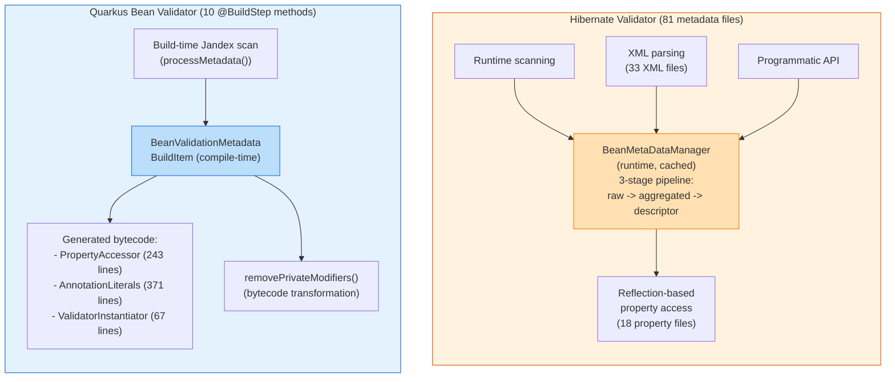
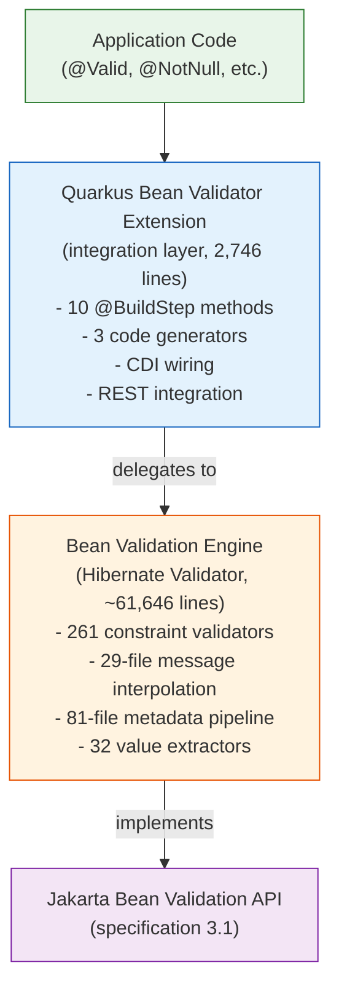
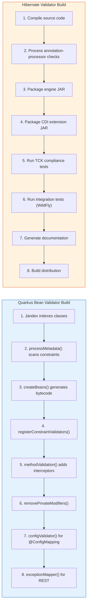

# Codebase Comparison: Quarkus Bean Validator vs Hibernate Validator

## Purpose and Relationship

These two projects serve different but complementary roles in the Jakarta Bean Validation ecosystem:

- **Hibernate Validator** is the **reference implementation** of the Jakarta Bean Validation specification. It is a standalone, full-featured validation engine.
- **Quarkus Bean Validator** is an **integration layer** that adapts Hibernate Validator (or a similar validation engine) for the Quarkus runtime, optimizing it for fast startup, low memory, and GraalVM native image compatibility.

They are not competing implementations - Quarkus Bean Validator wraps and enhances a validation engine for use within Quarkus.

---

## Scale Comparison

| Metric | Quarkus Bean Validator | Hibernate Validator |
|--------|----------------------|---------------------|
| Total Java source files | 18 (main) | 871 (main) |
| Lines of code (main) | 2,746 | ~61,646 (engine alone) |
| Test files | 35 | 1,048 |
| Test lines | 1,928 | ~80,000+ (estimated) |
| Modules | 2 (deployment + runtime) | 10+ (engine, cdi, annotation-processor, tck-runner, etc.) |
| External dependencies | ~6 | ~10+ |
| Spec version targeted | Jakarta BV 2.0+ | Jakarta BV 3.1 |
| Java version | 17+ | 17+ |
| Localization | 2 (en, fr) in tests | 27 languages |

---

## Architectural Comparison

### Design Philosophy

| Aspect | Quarkus Bean Validator | Hibernate Validator |
|--------|----------------------|---------------------|
| **Processing time** | Build-time (compile) | Runtime |
| **Reflection usage** | Eliminated via code generation | Heavy use of reflection |
| **Metadata discovery** | Jandex index scanning at build time | Runtime class scanning |
| **CDI integration** | Built into framework (Arc) | Portable CDI extension |
| **Configuration** | Build-time config + recorders | Runtime XML + programmatic API |
| **Native image** | First-class GraalVM support | Requires additional configuration |
| **Startup time** | Optimized (pre-computed metadata) | Standard (runtime initialization) |
| **Extension status** | Experimental | Stable (reference implementation) |

### Metadata Handling

**Hibernate Validator** discovers and aggregates metadata at runtime from multiple sources (annotations, XML, programmatic API) through a 3-stage pipeline (raw -> aggregated -> descriptor). It uses reflection to access bean properties and create constraint validator instances.

**Quarkus Bean Validator** performs metadata discovery once at build time using Jandex (a bytecode index). It generates concrete Java classes (via Gizmo2) that replace reflection-based operations, enabling native image compilation and faster startup. It also transforms bytecode to remove `private` modifiers from constrained fields.

### Jakarta BV API Implementation Comparison

Both projects implement the same Jakarta BV specification interfaces, but with fundamentally different approaches:

```mermaid
graph TB
    subgraph SPEC["Jakarta Bean Validation API"]
        VP["ValidationProvider"]
        CFG["Configuration /<br/>ConfigurationState"]
        VF["ValidatorFactory"]
        V["Validator /<br/>ExecutableValidator"]
        BD["BeanDescriptor"]
        CVF["ConstraintValidatorFactory"]
    end

    subgraph HV["Hibernate Validator Implementations"]
        HVP["HibernateValidator<br/>+ PredefinedScopeHibernateValidator"]
        HCFG["AbstractConfigurationImpl (32 KB)<br/>+ ConfigurationImpl<br/>+ PredefinedScopeConfigurationImpl"]
        HVF["ValidatorFactoryImpl (20 KB)<br/>+ PredefinedScopeValidatorFactoryImpl (18 KB)"]
        HVI["ValidatorImpl (60 KB)<br/>- BeanMetaDataManager<br/>- ConstraintValidatorManager<br/>- ValidationOrderGenerator<br/>- ValueExtractorManager"]
        HBD["BeanDescriptorImpl<br/>extends ElementDescriptorImpl (abstract, Serializable)<br/>- PropertyDescriptorImpl<br/>- ExecutableDescriptorImpl<br/>- ConstraintDescriptorImpl (Serializable)"]
        HCVF["DefaultConstraintValidatorFactory<br/>(reflection-based)"]
    end

    subgraph QBV["Quarkus Bean Validator Implementations"]
        QVP["QuarkusValidationProvider (220 lines)<br/>- static RuntimeConfig record<br/>- annotation literal cache<br/>- property accessor cache"]
        QCFG["QuarkusConfiguration (262 lines)<br/>- always ignores XML<br/>- injects BeanValidationMetadata"]
        QVF["QuarkusValidatorFactory (113 lines)<br/>- lazy singleton QuarkusValidator"]
        QVI["QuarkusValidator (3,419 lines)<br/>- ConcurrentHashMap caches<br/>- groupSequenceStepsCache<br/>- validatorCache<br/>- descriptorCache"]
        QBD["BeanDescriptorImpl (480 lines)<br/>- built from ConstrainedBeanMetadata<br/>- PropertyDescriptorImpl<br/>- MethodDescriptorImpl<br/>- ConstraintDescriptorImpl"]
        QCVF["ArcConstraintValidatorFactory (54 lines)<br/>(CDI-first, generated instantiator fallback)"]
    end

    VP --> HVP & QVP
    CFG --> HCFG & QCFG
    VF --> HVF & QVF
    V --> HVI & QVI
    BD --> HBD & QBD
    CVF --> HCVF & QCVF

    style SPEC fill:#f3e5f5,stroke:#7B1FA2
    style HV fill:#fff3e0,stroke:#E65100
    style QBV fill:#e3f2fd,stroke:#1565C0
```

| Jakarta BV Interface | Hibernate Validator | Quarkus Bean Validator |
|---|---|---|
| `ValidationProvider` | `HibernateValidator` (38 lines) + `PredefinedScopeHibernateValidator` | `QuarkusValidationProvider` (220 lines) with static `RuntimeConfig` |
| `Configuration` | `AbstractConfigurationImpl` (32 KB) + 2 subclasses | `QuarkusConfiguration` (262 lines), always ignores XML |
| `ValidatorFactory` | `ValidatorFactoryImpl` (20 KB) + `PredefinedScopeValidatorFactoryImpl` (18 KB) | `QuarkusValidatorFactory` (113 lines) |
| `Validator` | `ValidatorImpl` (60 KB), also implements `ExecutableValidator` | `QuarkusValidator` (3,419 lines) + `QuarkusExecutableValidator` |
| `ConstraintValidatorFactory` | `DefaultConstraintValidatorFactory` (reflection) | `ArcConstraintValidatorFactory` (CDI + generated instantiator) |
| `BeanDescriptor` | `BeanDescriptorImpl` extends `ElementDescriptorImpl` (abstract, `Serializable`, `@Immutable`) | `BeanDescriptorImpl` (standalone, built from `ConstrainedBeanMetadata`) |
| `ConstraintDescriptor` | `ConstraintDescriptorImpl` (`Serializable`, full composition support) | `ConstraintDescriptorImpl` (lightweight, no serialization) |
| Descriptor base class | `ElementDescriptorImpl` (abstract, shared hierarchy) | `AbstractCascadableDescriptorImpl` + `AbstractExecutableDescriptorImpl` |
| Metadata source | Runtime reflection via `BeanMetaDataManager` + 3 `MetaDataProvider`s | Build-time `BeanValidationMetadata` from Jandex scan |
| Validator caching | `ConstraintValidatorManagerImpl` with composite cache keys | `ConcurrentHashMap<ValidatorCacheKey, ConstraintValidator>` |
| Group ordering | `ValidationOrderGenerator` (dedicated 7-file subsystem) | Inline in `QuarkusValidator` with `groupSequenceStepsCache` |

### CDI Integration

| Aspect | Quarkus (Arc) | Hibernate Validator (CDI Extension) |
|--------|--------------|--------------------------------------|
| Extension mechanism | `@BuildStep` processors (10 methods) | CDI Portable Extension (3 lifecycle callbacks) |
| Bean registration | Synthetic CDI beans at build time | Runtime AfterBeanDiscovery |
| Interceptors | Arc interceptors with annotation transformers | Manual interceptor binding via `ValidationEnabled*` |
| Validator creation | `ArcConstraintValidatorFactory` (54 lines) | `InjectingConstraintValidatorFactory` + `DestructibleBeanInstance` |
| Lifecycle | Build-time wiring, runtime execution | Full runtime lifecycle |
| Validator/ValueExtractor discovery | `registerConstraintValidatorsAndValueExtractors()` scan | `ProcessAnnotatedType` event scanning |
| Helper classes | 1 (ArcConstraintValidatorFactory) | 5+ (ValidationProviderHelper, GetterPropertySelectionStrategyHelper, etc.) |

### Method Validation

Both implement method-level validation via CDI interceptors, but differently:

**Hibernate Validator:**
- Uses standard CDI interceptor binding
- `@ValidateOnExecution` annotation controls which methods are validated
- Interceptor discovers constraints at runtime
- 4 `ValidationEnabled*` classes handle annotation enrichment

**Quarkus Bean Validator:**
- `MethodValidatedAnnotationsTransformer` (107 lines) adds interceptor bindings at build time
- Separate bindings for regular methods (`@MethodValidated`) and REST endpoints (`@JaxrsEndPointValidated`)
- REST-specific interceptor wraps violations as `ResteasyReactiveViolationException` for proper HTTP status codes
- `gatherJaxRsMethods()` scans for JAX-RS annotations to distinguish REST endpoints from regular beans

### REST Integration

| Feature | Quarkus Bean Validator | Hibernate Validator |
|---------|----------------------|---------------------|
| REST framework | ResteasyReactive (optional, conditional on `Capability.RESTEASY_REACTIVE`) | None (left to integrators) |
| Exception mapping | Built-in `ViolationExceptionMapper` (100 lines) | Not included |
| Status code handling | 400 for param violations, 500 for return value violations | Not applicable |
| Error response format | `ViolationReport` JSON with violations list (95 lines) | Not applicable |
| Media type negotiation | `ValidatorMediaTypeUtil` (57 lines) | Not applicable |

Quarkus provides out-of-the-box REST error handling, while Hibernate Validator leaves this to the application or framework.

### Configuration Validation

**Quarkus** uniquely provides SmallRye Config integration:
- `QuarkusBeanValidationConfigValidator` (63 lines) validates `@ConfigMapping` interfaces
- `configValidator()` build step generates validators for config mappings
- Produces `StaticInitConfigBuilderBuildItem` and `RunTimeConfigBuilderBuildItem`
- Config is validated at startup before the application starts

**Hibernate Validator** does not include framework-specific config validation.

---

## Feature Matrix

| Feature | Quarkus BV | Hibernate Validator |
|---------|-----------|---------------------|
| Field validation | Delegated | Full implementation |
| Method validation | CDI interceptors (build-time binding) | CDI interceptors (runtime binding) |
| Constructor validation | CDI interceptors | Direct API |
| Group sequences | Delegated | Full implementation |
| Custom constraints | Supported via CDI (auto-registered) | Full support |
| Constraint composition | Delegated | Full implementation |
| XML constraint mapping | Not supported | Full support (33 XML files) |
| Programmatic constraint API | Not exposed | Full fluent API (84 cfg files) |
| Value extractors | Supported (auto-registered from CDI) | Full implementation (32 files, 26 built-in extractors) |
| Message interpolation | Delegated | Full engine with EL support (29 files, parser + EL resolution) |
| Compile-time annotation checking | No | Yes (53-file annotation-processor) |
| GraalVM native image | First-class (code generation + bytecode transformation) | Requires manual config |
| Dev mode / live reload | Built-in (tested) | Not applicable |
| Config mapping validation | Yes (SmallRye) | No |
| REST error responses | Built-in (ViolationReport JSON) | Not included |
| Locale support | Build-time configured (2 locales in tests) | Runtime configured (27 languages) |
| Custom TraversableResolver | Delegated | Full SPI (6 resolver files) |
| Script-based constraints | Not exposed | @ScriptAssert support (2 scripting files) |
| Regional validators | Delegated | CPF, CNPJ, NIP, PESEL, REGON, INN, KorRRN |
| Performance benchmarks | No | JMH benchmark suite |
| TCK compliance | Indirect | Direct TCK runner |
| Predefined scope optimization | No | PredefinedScopeValidatorFactoryImpl (18 KB) |
| Thread safety documentation | Implicit (build-time) | Explicit (@Immutable, @ThreadSafe annotations) |

---

## Dependency Relationship

---

## Build Pipeline Comparison

---

## When to Use Which

| Scenario | Recommendation |
|----------|---------------|
| Building a Quarkus application | Use Quarkus Bean Validator (it wraps HV internally) |
| Building a standalone Java SE app | Use Hibernate Validator directly |
| Need GraalVM native image | Use Quarkus Bean Validator |
| Need XML constraint mappings | Use Hibernate Validator directly |
| Need programmatic constraint API | Use Hibernate Validator directly |
| Need fastest possible startup | Use Quarkus Bean Validator |
| Need compile-time constraint checking | Use Hibernate Validator annotation-processor |
| Building a custom framework | Use Hibernate Validator as the engine |
| Need high-frequency predefined-scope validation | Use Hibernate Validator's PredefinedScopeValidatorFactoryImpl |
| Need regional ID validators (CPF, NIP, etc.) | Hibernate Validator (available via QBV delegation too) |
